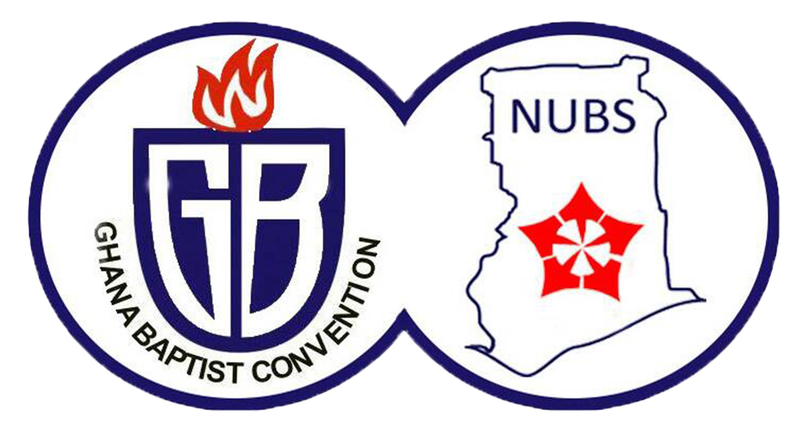

# NUBS UCC WEBSITE 

## Summary
This website was created to aid the assimilation of information concerning the **National Union of Baptist Students (NUBS) UCC** and NUBS Ghana in general to the alumni and the general public.

It contains the following pages/tabs:

- [NUBS UCC WEBSITE ](#nubs-ucc-website-)
  - [Summary](#summary)
  - [Home Page](#home-page)
  - [About Page](#about-page)
  - [News/Events Page](#newsevents-page)
  - [Testimonies](#testimonies)
  - [Gallery](#gallery)
  - [Departments](#departments)
  - [Executives](#executives)
  - [Contact](#contact)
  - [Donate](#donate)
    - [For more inormation](#for-more-inormation)

 

## Home Page
This page contains the general overview of what NUBS UCC is all about. It has the welcome address, the vision and mission of the union, carousels of testimonies and events as well as the weekly activities for the semester.

 

## About Page
The about page tells the viewer all about NUBS UCC and NUBS Ghana in general. It also includes the NUBS Anthem.

 

## News/Events Page
This page displays all activities intended to be held by the union during that academic year. It may include activities which go beyond or start after the academic year. The activities for the semester can also be found here.

 

## Testimonies
This page displays in a grid layout, testimonies of individuals in and out of the union. Anyone can add a testimony, however to prevent this page from being abused, any testimony submitted will have to be inspected by an admin before it will be made public on the testimonies page.

 

## Gallery
This page displays in a grid layout, the albums of the union. Each album links to an instagram post which contains picture to a particular event conducted by NUBS UCC.

 

## Departments
This page displays the various departments in the union. The departments are the _MUSIC WING, BIBLE STUDY WING, ORGANISING WING, EVANGELISM WING_ and the _DRAMA AND CHOREOGRAPHY WING_.

 

## Executives
This page displays basic information of the current and the past executives (though this list starts from the 2019/2020 year group of executives).

 

## Contact
This page displays a form through which anyone using the platform can contact the union for any enquiry.

 

## Donate
This page displays and provides information on the current and up coming projects the union is embarking on. Anyone who would like to support the union in any way can see the steps on how to do so on this page.

 

### For more inormation
Follow us on our social media platforms: 

 &nbsp;
 &nbsp;
